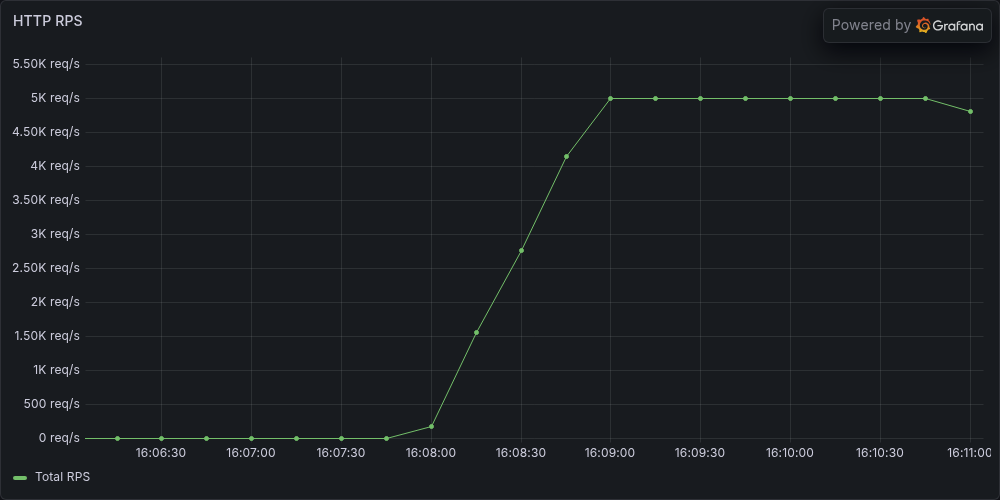
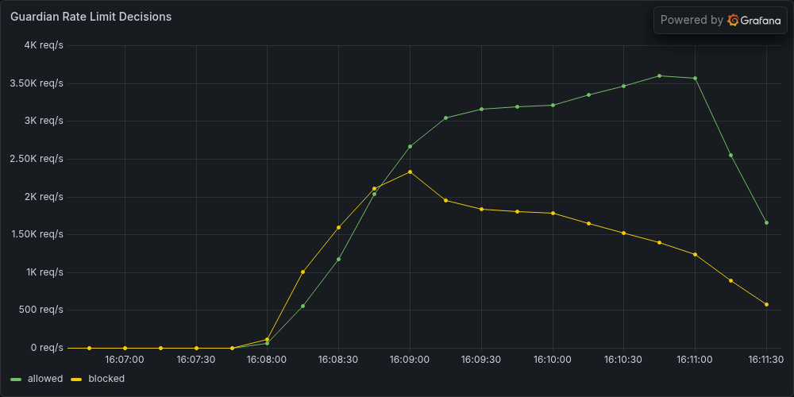
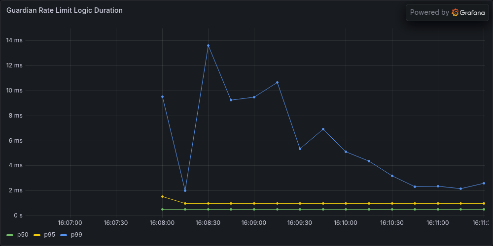
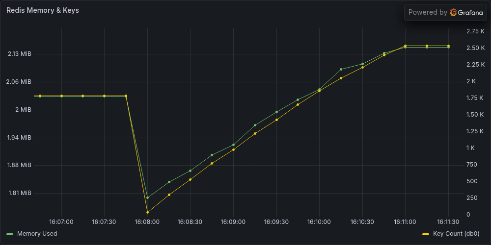

# Guardian

Distributed rate-limiting library for Spring Boot. Redis-backed Lua scripts for atomic evaluation, AOP annotations for non-intrusive enforcement, dynamic configuration sync at runtime.


## Table of Contents

- [How It Works](#how-it-works)
- [Algorithms](#algorithms)
- [Configuration](#configuration)
- [Usage](#usage)
- [Performance](#performance)
- [Getting Started](#getting-started)
- [Load Tests](#load-tests)
- [Extensibility](#extensibility)
- [Project Structure](#project-structure)
- [Observability](#observability)

## How It Works

1. Annotate a controller method with `@GuardianRateLimit`
2. AOP aspect intercepts the call, resolves the key via SpEL
3. Redis Lua script atomically evaluates the rate limit
4. Request is allowed or rejected with HTTP 429

```java
@GetMapping("/api/v1/payments")
@GuardianRateLimit(key = "#userId", plan = "pro_plan", quota = "read_limit")
public ResponseEntity<String> getPayments(@RequestParam String userId) {
    return ResponseEntity.ok("Success");
}
```

## Algorithms

### Token Bucket

Allows controlled bursts up to `bucketCapacity`, then refills at `refillRate` tokens/second. Stored as a Redis HASH (`t: tokens`, `r: last_refill_timestamp`).

### Sliding Window Counter

Weighted estimate across previous and current time windows. Smoother than fixed windows. Parameters: `requestLimit` and `windowSizeInSeconds`.

## Configuration

```yaml
guardian:
  dynamic-config:
    refresh-rate: 60000       # polls Redis for config changes (ms)
  token-bucket:
    enabled: true
    failure-mode: open        # open = allow on Redis failure, closed = block
    plans:
      pro_plan:
        read_limit:
          bucketCapacity: 100
          refillRate: 50
  sliding-window-counter:
    enabled: true
    failure-mode: closed
    plans:
      strict_plan:
        default:
          requestLimit: 5
          windowSizeInSeconds: 60
```

Algorithms only load if `enabled: true`. The aspect itself only loads if at least one `RateLimiter` bean exists.

### Dynamic Configuration

`GuardianConfigScheduler` polls Redis keys (`guardian:config:*`) on a fixed interval. Valid JSON found in Redis atomically replaces the in-memory config. Malformed or missing keys fall back to the YAML baseline.

### Failure Modes

| Mode | On Redis failure | Use when |
|---|---|---|
| `open` | Allow the request | Availability matters most |
| `closed` | Block the request | Strict quota enforcement |

## Usage

```java
// Token Bucket (default algorithm)
@GuardianRateLimit(key = "#userId", plan = "pro_plan", quota = "read_limit")

// Sliding Window
@GuardianRateLimit(algorithm = "slidingWindowCounterRateLimiter", key = "#req.accountId", plan = "strict_plan")

// SpEL expressions for keys
@GuardianRateLimit(key = "#request.getRemoteAddr()")
```

When a limit is breached, `RateLimitExceededException` is thrown. Handle it with `@ControllerAdvice` to return HTTP 429.

## Performance

Benchmarked on Docker for Mac (4 CPU / 3GB app container, single Redis). Full data: [`tests/LOAD_TEST_FINDINGS.md`](tests/LOAD_TEST_FINDINGS.md).

**Rate limiter overhead** (AOP + SpEL + Redis Lua round-trip):

| p50 | p95 | p99 |
|---|---|---|
| ~520us | ~980us | ~5ms |

**Throughput:** ~12,000-13,000 sustainable RPS, 0% error rate at 10k RPS.

**Atomicity:** 500 concurrent VUs on one key — exactly 5 allowed, 495 blocked. Zero leaks.

**Token bucket accuracy:** 1,598-1,599 allowed over 30s at 200 RPS (expected ~1,550). Within 3% of theoretical, reproduced across runs.

**Memory stability:** 3-minute soak at 5,000 RPS. Redis grew 227 KB. JVM heap stable. p95 latency held at 2ms throughout.

### Soak Test Panels (5,000 RPS, 3 minutes)

Sustained throughput held at 5K req/s with no degradation:



Rate limit decisions — allowed vs blocked under sustained load:



Rate limiter logic overhead — p50 stays under 1ms, p99 spikes correlate with GC pauses:



Redis memory and key count grow proportionally and plateau — no leak:



## Getting Started

**Prerequisites:** Java 21, Docker, Docker Compose

```bash
# Build
./gradlew clean build -x test

# Run tests (requires Docker for Testcontainers)
./gradlew clean test

# Run the full stack
docker-compose up --build -d
```

| Service | URL |
|---|---|
| App | http://localhost:8080 |
| Prometheus | http://localhost:9090 |
| Grafana | http://localhost:3000 (admin/admin) |
| cAdvisor | http://localhost:8082 |

## Load Tests

k6 test suite in `tests/`. Run individually or with `collect_metrics.sh` for Prometheus metrics + Grafana panel snapshots.

| Test | What it proves |
|---|---|
| `baseline.js` | Throughput ceiling (step-load to 20k RPS) |
| `thundering_herd.js` | Lua atomicity under 500 concurrent VUs |
| `noisy_neighbour.js` | Per-key isolation (malicious user can't affect others) |
| `high_cardinality.js` | Redis latency stability as key count grows to 90k+ |
| `token_bucket_accuracy.js` | Refill rate correctness (measured vs mathematical) |
| `soak.js` | Memory leak detection (JVM + Redis, 3 minutes) |

```bash
# Run with full metrics collection and Grafana snapshots
bash tests/collect_metrics.sh thundering_herd
bash tests/collect_metrics.sh soak
```

## Extensibility

Core interfaces follow the Strategy Pattern. Add custom algorithms or storage backends without modifying the library.

**Custom algorithm:**

```java
@Component("leakyBucketRateLimiter")
public class LeakyBucketRateLimiter implements RateLimiter {
    @Override
    public boolean allow(RateLimitRequest request) { /* ... */ }
}
```

**Custom storage:** Implement `TokenBucketStore` or `SlidingWindowStore` for any backend (Cassandra, PostgreSQL, etc).

**Use it:**

```java
@GuardianRateLimit(algorithm = "leakyBucketRateLimiter")
```

The AOP infrastructure resolves the bean by name at runtime.

## Project Structure

```
guardian-core/                 Core library (published as plain JAR)
├── annotation/                @GuardianRateLimit
├── aspect/                    AOP interceptor, SpEL evaluation
├── ratelimiter/impl/
│   ├── tokenbucket/           Token Bucket algorithm + stores
│   └── slidingwindowcounter/  Sliding Window algorithm + stores
├── sync/                      Dynamic config scheduler
└── resources/scripts/         Redis Lua scripts

guardian-test-server/          Sample app with test endpoints
monitoring/                    Prometheus + Grafana provisioning
tests/                         k6 load tests, metrics collection, snapshots
```

## Observability

Guardian emits Micrometer metrics for every rate-limit evaluation, tagged by algorithm, plan, quota, and result (allowed/blocked/error).

| Metric Name | Type | Description |
| :--- | :--- | :--- |
| `guardian.ratelimit.logic` | Timer | Latency of the rate-limiting decision, tagged by `algorithm`, `plan`, `quota`, `result`. |
| `guardian.ratelimit.fallback` | Counter | Incremented when a failure mode (OPEN/CLOSED) is triggered, tagged by `plan`, `mode`. |
| `guardian.config.reload` | Counter | Tracks success/failure of dynamic configuration updates, tagged by `provider`, `status`. |
| `guardian.config.last_updated_timestamp` | Gauge | Epoch timestamp of the last successful config synchronization. |

The `docker-compose.yml` stack includes Prometheus, Grafana (with provisioned dashboards), cAdvisor, Redis exporter, and a Grafana image renderer for automated panel snapshots.
