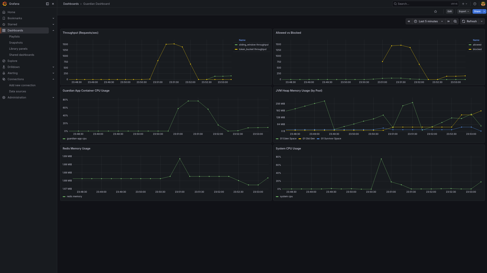

# Guardian: Distributed Rate Limiting Library

Guardian is an educational project built to learn how to implement highly concurrent, resilient, and dynamically configurable distributed rate-limiting library for Spring Boot applications. Designed as a drop-in core library (`guardian-core`) with an accompanying test server, it provides robust API protection using Redis-backed atomicity, Aspect-Oriented Programming (AOP), and real-time configuration sync.

---

## Table of Contents

- [Architecture & Key Design Choices](#️-architecture--key-design-choices)
    - [Concurrency & Atomicity (The "Thundering Herd" Problem)](#1-concurrency--atomicity-the-thundering-herd-problem)
    - [Annotation-Driven AOP & SpEL Context](#2-annotation-driven-aop--spel-context)
    - [Real-Time Dynamic Configuration](#3-real-time-dynamic-configuration)
    - [Resiliency & Failure Modes](#4-resiliency--failure-modes)
    - [Deep Observability](#5-deep-observability)
- [Algorithms Implemented](#️-algorithms-implemented)
    - [Token Bucket](#1-token-bucket)
    - [Sliding Window Counter](#2-sliding-window-counter)
- [Getting Started](#-getting-started)
    - [Prerequisites](#prerequisites)
    - [Running the Full Stack](#running-the-full-stack)
- [Usage Guide](#-usage-guide)
    - [Protecting an Endpoint](#1-protecting-an-endpoint)
    - [Baseline Configuration (YAML)](#2-baseline-configuration-yaml)
    - [Exception Handling](#3-exception-handling)
- [Testing & Validation](#-testing--validation)
    - [Unit & Integration Tests](#unit--integration-tests)
    - [Load Testing (k6)](#load-testing-k6)
- [Project Structure](#-project-structure)
- [Pluggable Architecture & Extensibility (Open-Closed Principle)](#6-pluggable-architecture--extensibility-open-closed-principle)
    - [Bring Your Own Algorithm (BYOA)](#bring-your-own-algorithm-byoa)
    - [Bring Your Own Storage (BYOS)](#bring-your-own-storage-byos)
    - [Dynamic Routing](#dynamic-routing)
  
---

# Architecture & Key Design Choices

Guardian is built with a focus on high throughput, zero race conditions, and graceful degradation.

## 1. Concurrency & Atomicity (The "Thundering Herd" Problem)

### Redis Lua Scripts (Primary)

Rate-limiting logic (Token Bucket and Sliding Window) is pushed directly to Redis via embedded Lua scripts. This ensures **100% atomicity** during high-concurrency bursts without the overhead of distributed locks or optimistic locking loops.

### Data Structures

The Token Bucket uses a Redis **HASH** to store available tokens and the last refill timestamp efficiently.

### Fallback Storage Mechanisms

The project includes an educational implementation of:

- Redis `WATCH/MULTI/EXEC` transactional store
- `ConcurrentHashMap` based in-memory store for non-distributed testing

---

## 2. Annotation-Driven AOP & SpEL Context

Rate limits are enforced non-intrusively via the `@GuardianRateLimit` annotation.

### Spring Expression Language (SpEL)

The annotation supports SpEL, allowing dynamic resolution of rate-limit keys directly from:

- method parameters

Examples:

```
#user.id
#request.getRemoteAddr()
```

---

## 3. Real-Time Dynamic Configuration

Rate limits often need to be adjusted during live incidents (for example a sudden traffic spike).

Guardian uses a **GuardianConfigScheduler** that polls Redis (`guardian:config:*`) for configuration updates.

Behavior:

1. If a valid JSON configuration is found  
   → it atomically swaps the configuration reference in memory without requiring an application restart.

2. If the Redis configuration is malformed or missing  
   → it safely falls back to the baseline YAML configuration.

---

## 4. Resiliency & Failure Modes

### Fail-Open vs Fail-Closed

If the Redis cluster becomes unavailable or a timeout occurs, Guardian intercepts the exception and evaluates the configured failure mode.

**OPEN**

- Swallows the exception
- Allows the request to pass
- Prioritizes availability

**CLOSED**

- Blocks the request
- Prioritizes strict quota enforcement

---

## 5. Observability

Integrated with **Micrometer**, Guardian emits metrics for every rate-limit evaluation.

Metrics are categorized by:

- algorithm
- plan
- quota
- outcome (allowed, blocked, error)

The project includes a fully configured `docker-compose.yml` stack containing:

- **Prometheus** for scraping metrics
- **Grafana** for visualization
- **cAdvisor** for container-level resource monitoring

---

# Algorithms Implemented

## 1. Token Bucket

A highly optimized algorithm suitable for general API rate limiting and allowing controlled bursts.

**Parameters**

- `bucketCapacity` (maximum burst)
- `refillRate` (tokens added per second)

**Storage**

Redis Hash

```
{ 
  t: current_tokens,
  r: last_refill_timestamp 
}
```

---

## 2. Sliding Window Counter

Provides smoother traffic distribution than fixed window algorithms by calculating a weighted estimate of traffic based on previous and current window limits.

**Parameters**

- `requestLimit` (maximum requests)
- `windowSizeInSeconds` (rolling time frame)

**Storage**

Redis keys for current and previous window boundaries with TTLs.

---

# Getting Started

## Prerequisites

- Java 21
- Docker
- Docker Compose

---

## Running the Full Stack

The project includes a **guardian-test-server** that implements the library.

Spin up the application stack with Docker Compose:

```bash
docker-compose up --build -d
```

Services:

- App: http://localhost:8080
- Prometheus: http://localhost:9090
- Grafana: http://localhost:3000
    - User: `admin`
    - Pass: `admin`
- cAdvisor: http://localhost:8081

---

# Usage Guide

## 1. Protecting an Endpoint

Apply the `@GuardianRateLimit` annotation to any Spring-managed bean method.

```java
@RestController
public class PaymentController {

    // Token Bucket (Default)
    @GetMapping("/api/v1/payments")
    @GuardianRateLimit(key = "#userId", plan = "pro_plan", quota = "read_limit")
    public ResponseEntity<String> getPayments(@RequestParam String userId) {
        return ResponseEntity.ok("Success");
    }

    // Sliding Window
    @PostMapping("/api/v1/payments")
    @GuardianRateLimit(
        algorithm = "slidingWindowCounterRateLimiter",
        key = "#paymentRequest.accountId",
        plan = "strict_plan"
    )
    public ResponseEntity<String> processPayment(@RequestBody PaymentRequest paymentRequest) {
        return ResponseEntity.ok("Processed");
    }
}
```

---

## 2. Baseline Configuration (YAML)

Define rate-limit plans in `application.yml`.

```yaml
guardian:
  token-bucket:
    enabled: true
    failure-mode: open # 'open' or 'closed'
    plans:
      pro_plan:
        read_limit:
          bucketCapacity: 100
          refillRate: 50

  sliding-window-counter:
    enabled: true
    plans:
      strict_plan:
        default:
          requestLimit: 5
          windowSizeInSeconds: 60
```

---

## 3. Exception Handling

When a limit is breached, a `RateLimitExceededException` is thrown.

The test server translates this exception into an HTTP response using `@ControllerAdvice`.

Resulting response:

```
HTTP 429 Too Many Requests
```

---

# Testing & Validation

## Unit & Integration Tests

The `guardian-core` module is tested using **Testcontainers**, which spins up ephemeral Redis instances.

This ensures Lua scripts and concurrent logic are tested against real infrastructure.

```bash
./gradlew clean test
```

---

## Load Testing (k6)

A **k6 test matrix** is included to validate atomicity and performance under heavy load.

```
tests/
```

Run tests:

```bash
# Baseline test
k6 run tests/load_test_matrix.js

# Hot-key scenario (high contention on a single Redis key)
k6 run -e SCENARIO=hot_key tests/load_test_matrix.js
```

---

# Project Structure

```
guardian-core/
```

Core rate-limiting library.

**Key modules**

```
annotation/
aspect/
```

- SpEL evaluation
- method interception

```
ratelimiter/
```

Algorithm implementations

- Token Bucket
- Sliding Window

```
storage/
```

Storage backends

- Redis Lua
- Transactional
- In-memory

```
sync/
```

Real-time configuration synchronization logic.

```
src/main/resources/scripts/
```

Optimized Lua scripts.

```
guardian-test-server/
```

Sample Spring Boot application demonstrating the library.

```
monitoring/
```

Prometheus configuration.

```
tests/
```

k6 load testing scripts.

---

# 6. Pluggable Architecture & Extensibility (Open-Closed Principle)

Guardian follows the **Strategy Pattern**.

The framework is:

- **Closed for modification**
- **Open for extension**

Core behaviors are decoupled through strict interfaces:

- `RateLimiter`
- `TokenBucketStore`
- `SlidingWindowStore`

---

## Bring Your Own Algorithm (BYOA)

Developers can implement custom algorithms (for example **Leaky Bucket**) by implementing:

```
RateLimiter
```

and registering it as a Spring bean:

```java
@Component("myCustomLimiter")
```

---

## Bring Your Own Storage (BYOS)

If Redis is not suitable, developers can replace the persistence layer with:

- Cassandra
- PostgreSQL

by implementing the appropriate **Store interface**.

---

## Dynamic Routing

Custom implementations integrate with the existing AOP infrastructure.

Example:

```java
@GuardianRateLimit(algorithm = "myCustomLimiter")
```

At runtime, Guardian dynamically resolves the bean and routes requests to the custom limiter **without modifying the core library**.